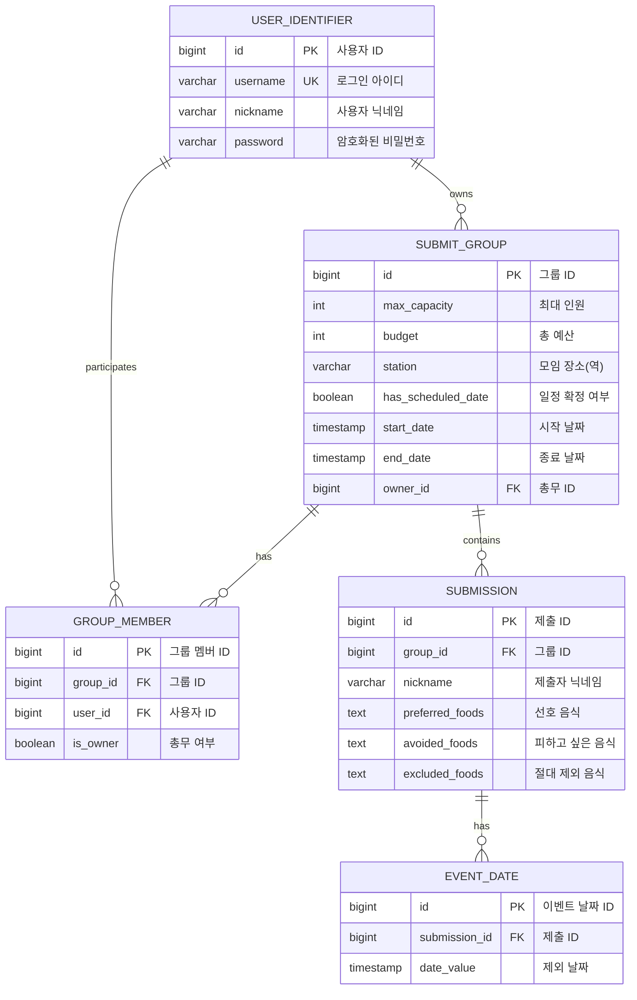
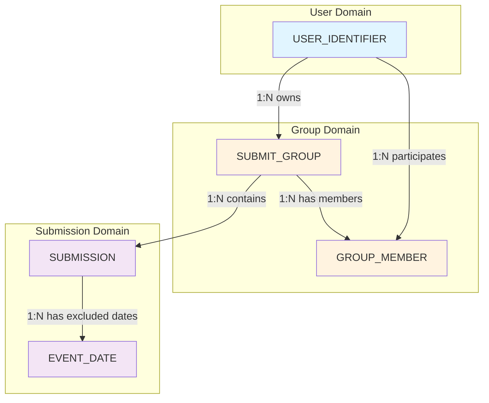
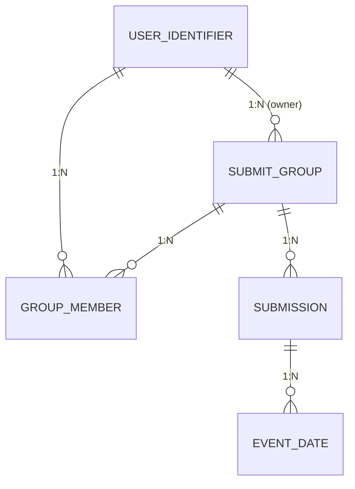
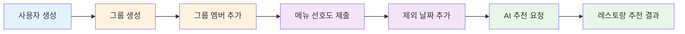
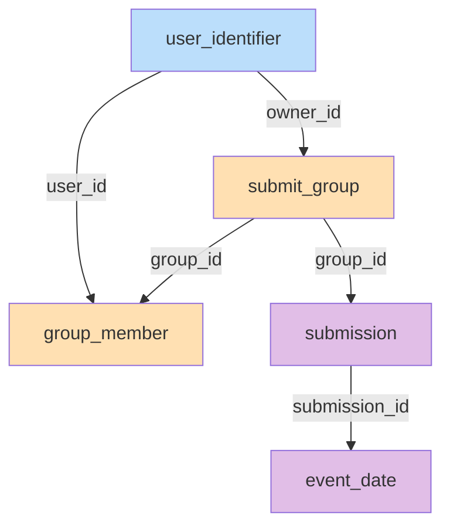
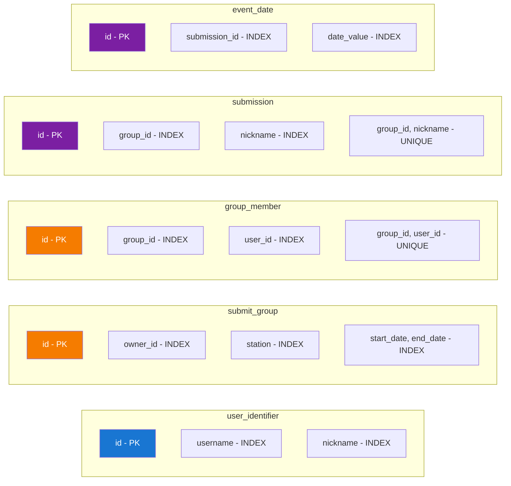
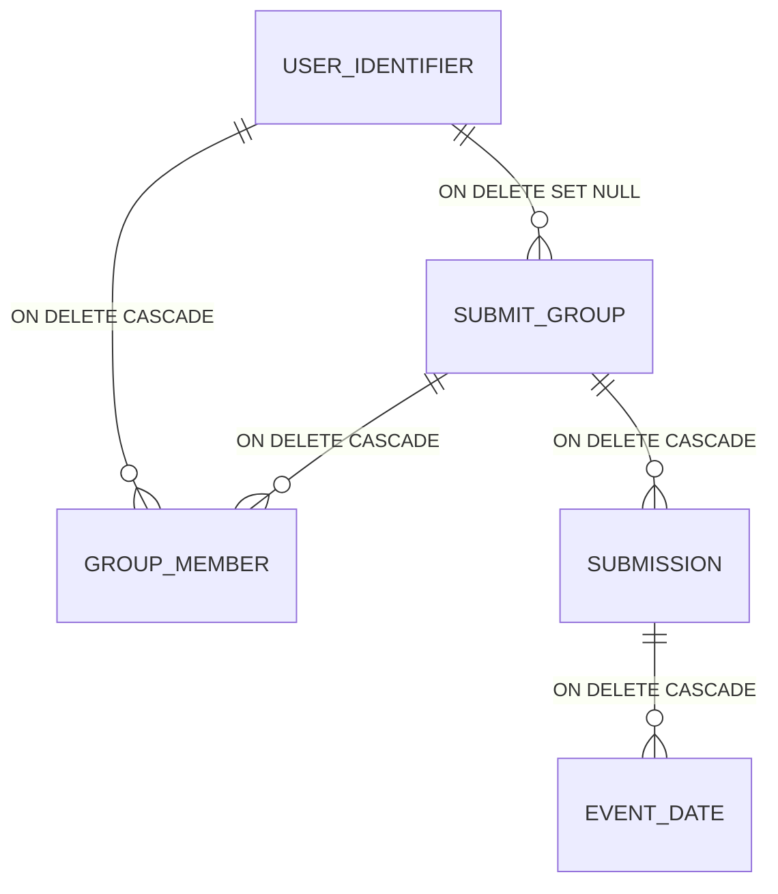
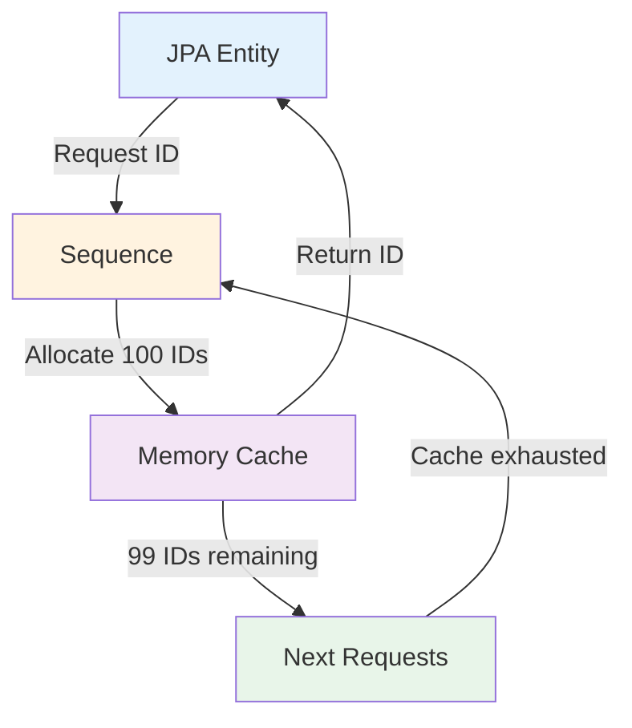
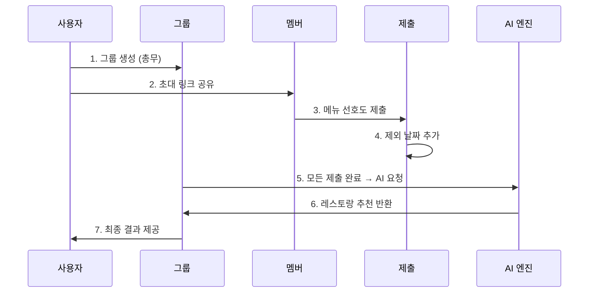
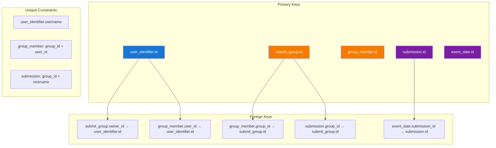

# Entity Relationship Diagram (ERD)

## Mermaid ERD

## Detailed Relationship Diagram

## Cardinality Summary

## Database Flow Diagram

## Table Dependencies

## Indexes Visualization

## Foreign Key Relationships with Cascade Rules

## Sequence Allocation Strategy

**Sequences:**
- `user_seq` (increment by 100)
- `group_seq` (increment by 100)
- `group_member_seq` (increment by 100)
- `userSubmission_seq` (increment by 100)

## Data Flow: 회식 추천 프로세스

## Constraint Hierarchy

